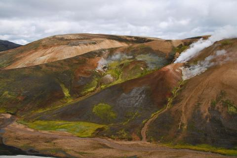
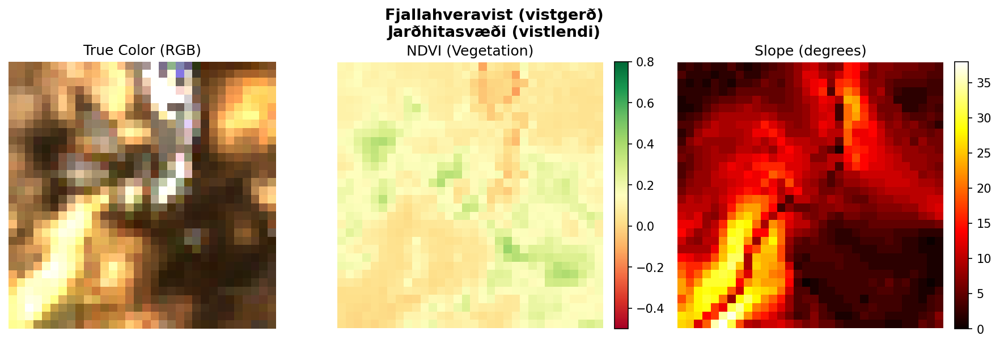
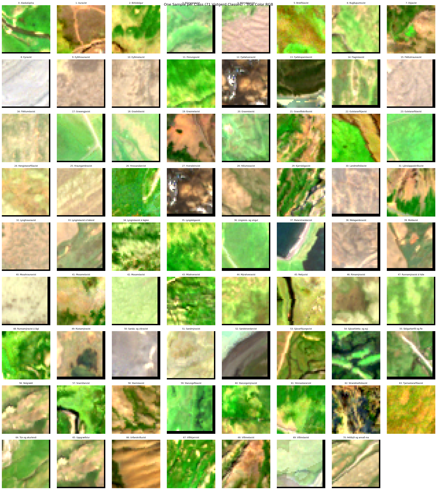

# Icelandic Habitat Classification

Classify Icelandic landscapes from satellite imagery!



*Fjallahveravist (geothermal alpine habitat) - Photo: Náttúrufræðistofnun Íslands*

Iceland has one of the most detailed habitat mapping systems in the world, with **71 habitat types** (*vistgerðir*) grouped into **13 habitat categories** (*vistlendi*). Your task is to build a model that identifies these habitats from satellite images.

Each image is a 35×35 pixel patch captured by the Sentinel-2 satellite, combined with terrain data from the Icelandic national elevation model. The patches cover a 350×350 meter area of land.

## The Challenge

Given a satellite image patch, predict which of the 71 habitat types (*vistgerð*) it belongs to.

**Input:** A numpy array of shape `(15, 35, 35)` containing:

| Channels | Description |
|----------|-------------|
| 0-11 | Sentinel-2 spectral bands (coastal aerosol through SWIR) |
| 12 | Elevation (meters above sea level) |
| 13 | Slope (degrees) |
| 14 | Aspect (compass direction of slope) |

**Output:** An integer from 0 to 70 representing the predicted habitat type (*vistgerð*).

### Example: Satellite Patch

Here's what a satellite patch looks like for the Fjallahveravist habitat shown above:



## Data

The data comes from summer (July-August) satellite imagery over Iceland, combined with high-resolution terrain data.

| Dataset | Samples | Purpose |
|---------|---------|---------|
| Training | 5,186 | Build your model |
| Validation | 799 | Test during competition |
| Test | 1,998 | Final evaluation |

The validation and test sets were split to maintain similar class distributions as training.

**Training data:** `data/train/patches.npy` and `data/train.csv`

```python
from utils import load_training_data

patches, labels = load_training_data()
print(f"Patches: {patches.shape}")  # (5186, 15, 35, 35)
print(f"Labels: {labels.shape}")    # (5186,)
```

### All 71 Habitat Types

Here's a sample satellite image from each of the 71 habitat types:



## Scoring

Your model is scored using **Weighted F1 Score**:

```
F1_weighted = Σ (n_c / N) × F1_c
```

Where `n_c` is the number of samples in class `c` and `N` is the total samples.

The baseline (random stratified sampling) achieves ~4% weighted F1.

## Evaluation

During the competition, you can validate against the validation set multiple times. **You can only submit to the test set once!**

Your endpoint must respond within **10 seconds per image**.

## Getting Started

### 1. Setup

Clone the repo and create a virtual environment:

```bash
git clone <repo-url>
cd habitat-classification

# Using uv (recommended)
uv venv && source .venv/bin/activate
uv pip install -r requirements.txt

# Or using pip
python -m venv .venv && source .venv/bin/activate
pip install -r requirements.txt
```

### 2. Develop Your Model

Use the training data to build and train your model. Update `model.py` with your prediction logic.

### 3. Test Locally

Start your API locally to test:

```bash
python api.py
```

Navigate to http://localhost:4321 to verify it's running.

### 4. Submit

When ready to submit:

1. Create a virtual machine (Azure, AWS, GCP, or similar)
2. Clone your repo on the VM
3. Run `python api.py` on the VM
4. Go to the submission portal
5. Enter your VM's IP address and API key
6. Press submit and wait for your score

See the main competition README for detailed submission instructions.

## About the Data

The satellite imagery was extracted from Google Earth Engine:

- **Sentinel-2 Level 2A** surface reflectance (12 spectral bands)
- **Cloud Score Plus** filtering (threshold 0.6)
- **Summer median composite** (July-August 2023-2025)
- **IslandsDEM v1** for terrain features

The habitat labels come from the Icelandic Institute of Natural History (*Náttúrufræðistofnun Íslands*).

Good luck! 🇮🇸
